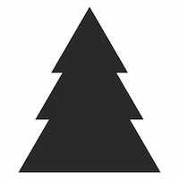
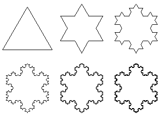

## Christmas Problems

If you're in the mood for a computation-themed Christmas, here are a few
problems to tinker with for when it's chilly outside and there's not a lot to
do. Each of these problems is based on a chapter that we've read in a meeting.

If you'd like to add your own problems, please fork this repository and submit
a pull request. You're more than welcome to do the same if you have a cracker of
a solution that you'd like to share.

## Problem 1: Random Tree

Generate random numbers that approximate the shape of a cut-out Christmas tree:

These random numbers should come in pairs (two-dimensional vectors). Each pair
corresponds to an (x, y) coordinate of the image plane. All generated points
should lie within the bounds of the tree and should appear in that region with
an equal probability.

Upgrades:

- Add a "trunk" at the base of your tree and a "star" at the top of your tree
- Decorate your tree with some colour
- Real trees are three-dimensional, so yours should be too!

## Problem 2: Koch Snowflake

The Koch Snowflake is a famous fractal that has an infinite perimiter, as well
as many other interesting properties. Generate a Koch Snowflake:

Provide a mechanism to set the number of iterations that should be computed when
generating the snowflake.

Upgrades:

- Colour your snowflake such that each triangle's colour intensity is inversely
proportional to its size
- Allow users to "zoom" in on regions of your snowflake
- Real snowflakes are three-dimensional, so yours should be too!
